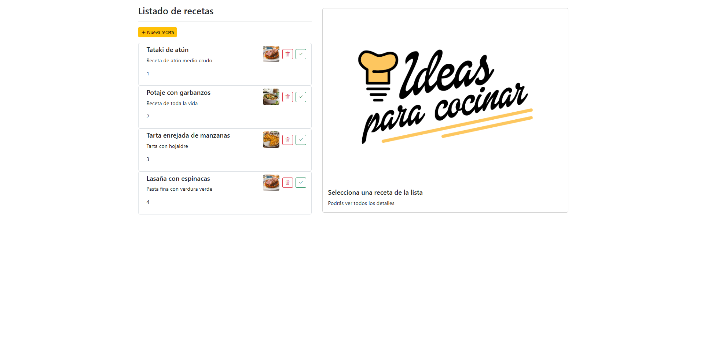
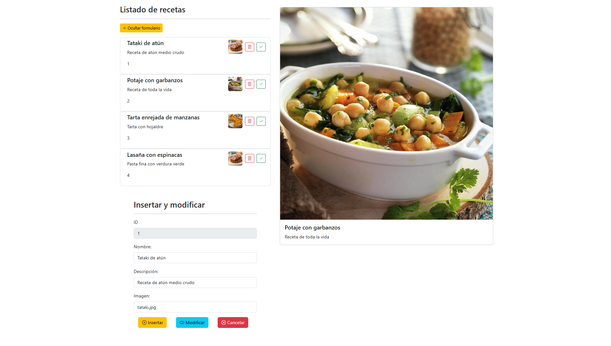

# 🍽️ Angular Recipe Manager

This is a simple web application built with Angular and Bootstrap to manage a collection of recipes. The project implements a **frontend-only CRUD system**, handling data through components and interfaces, without any database or backend service.

## 🚀 Features

- Angular SPA (Single Page Application)
- Bootstrap-styled interface
- List of predefined recipes
- Add, edit, and delete recipes (frontend only)
- Image support for each recipe (local files)

## 🛠️ Tech Stack

- Angular 18
- HTML / CSS / TypeScript
- Bootstrap

## 📸 Screenshots

  
  

